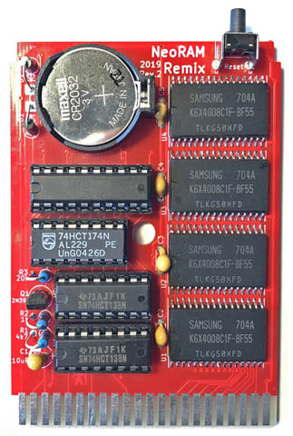
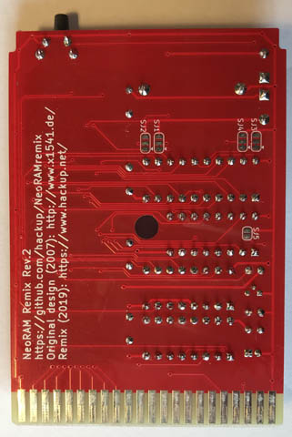
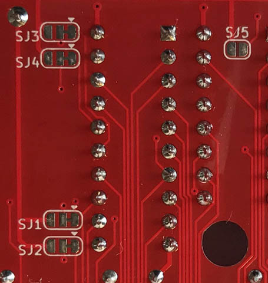

# NeoRAM Remix

The NeoRAM is a RAM extension for the Commodore 64/128 computers that is compatible with the GeoRAM modules. It features up to 2MB of RAM and it is battery buffered. A single CR2032 cell will usually preserve the data stored in the NeoRAM for several months.

The "remix" version is based on the [original NeoRAM](http://www.x1541.de/) developed by Nicolas Welte in 2006. Without further consent, both the original and the remix version are licensed for personal and non-commercial use only (see details below). There is also no warranty whatsoever. **USE AT YOUR OWN RISK!**.

## Configurations

The NeoRAM can be assembled in different configurations. By default, the PCB is configured for 2MB of RAM and battery buffering. There is no need to change any of the solder jumpers if the board is assembled completely.

If you choose to fit fewer RAM chips their respective decoupling caps can be omitted as well. The solder jumpers SJ3 and SJ4 on the backside of the PCB have to be changed to reflect the memory configuration:

| RAM    | SJ3 | SJ4 | ICs   | Caps  |
|--------|-----|-----|-------|-------|
| 2MB    | 1-2 | 1-2 | U1-U4 | C2-C5 |
| 1MB    | 1-2 | 2-3 | U1-U2 | C2-C3 |
| 512kB  | 2-3 | 2-3 | U1    | C2    |

If you decide you don't need the battery buffering, the following components can be omitted: BT1, D1, C1, R1-3, Q1. If you skip these components you need to close the solder jumper SJ5 on the back of the PCB. Also note that D2 is still required.

See the [NeoRAM Remix blog post](https://www.hackup.net/2019/04/the-neoram-remix/) for more details and the bill of materials.

## License

This work is licensed under a
[Creative Commons Attribution-NonCommercial-ShareAlike 4.0 International License](http://creativecommons.org/licenses/by-nc-sa/4.0/).
